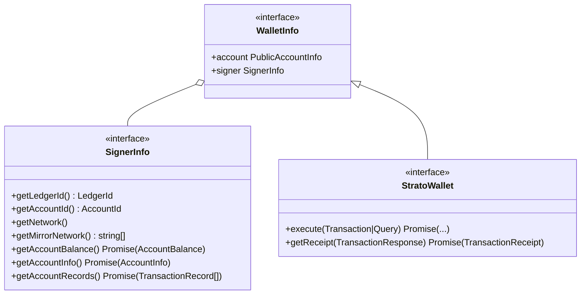

import BrowserOnly from '@docusaurus/BrowserOnly';
import { HeadStarterConnectWallet } from '@site/src/components/ConnectWallet';

## [HIP-338](https://hips.hedera.com/hip/hip-338) compliant

We might be the first non-official library to support Hedera's standardized wallet proposal and we're damn proud of it.

Want to give it a spin? Make sure you have [HashPack installed](https://www.hashpack.app/) and then connect to the docs page by clicking
<BrowserOnly fallback={<p>Wallet Button</p>}>{() => <HeadStarterConnectWallet /> }</BrowserOnly>

Then get a hold of [a Session that targets a `Browser` wallet](../configuration.md#HEDERAS_WALLET_TYPE) and use it normally:

```js live
const { session } = await ApiSession.default({ wallet: { type: "Browser" } });
const liveJson = await session.upload(new Json({ theAnswer: 42 }));

log(`Wallet account id used: ${session.wallet.account.id}`);
log(`Json is stored at ${liveJson.id}`);
log(`The answer is: ${liveJson.theAnswer}`);
```

:::note
We need here to intentionally specify the `{ wallet: { type: 'Browser' } }` object argument to `ApiSession.default` otherwise, [fallowing normal parameters resolution](../configuration.md#parameters-resolution), the strato bundle would have defaulted to using the implicit `Sdk` wallet type which was configured when bundling for use with these docs. This is actually the case for other live-code edits present on other pages.
:::

:::warning
Due to Hedera's pricing model as well as `Query` mechanics and, in general, overall `Executable` support from wallet extensions, only `Transaction`s are currently supported by our wallet-bridge implementation.

This means that only `wallet.getAccountBalance()` is supported and that, consequently, `wallet.getAccountInfo()` and `wallet.getAccountRecords()` are not.

This also means that contract creation/querying is not currently supported. We plan on mitigating this with a future Venin release by augmenting the data via [a mirror-node response](https://docs.hedera.com/guides/docs/mirror-node-api/rest-api).
:::

## Under the hood

:::caution
This feature is currently in active development. As such, it is very likely that the final API, once the stable release hits the streets, will differ.
:::

Based on the original HIP-338 proposal, we went on and simplified the overall `Wallet` interface to a `StratoWallet` which only currently knows 2 operations:

- executing `Transaction`s and `Query`s
- getting a `TransactionReceipt` for a `TransactionResponse`

:::note
`Sign`-ing mechanics are still being designed and considered and will probably see the light of day in a future release.
:::

We then extracted away the `Signer` query calls and isolated them into their own `SignerInfo` interface. `WalletInfo` glues everything up nicely and is made available on every session at `ApiSession.wallet`.



## Configuring

As seen above, there are currently 2 types of `wallet` backends:

- a, default, `Sdk` one which uses a re-implemented version of Hedera's `LocalWallet` and `LocalProvider` to also work with `customnet` networks
- a `Browser` one which, when selected, looks at a global `window.hedera` object and uses that as the `Wallet` sync for all transactions of that particular session

:::note
For `Browser` wallets, property names can be changed via the `HEDERAS_WALLET_WINDOW_PROPERTY_NAME`/`wallet.window.propName` config.
:::

The code for the HashPack HIP-338 wallet-bridge used in this page can be [found here](https://github.com/buidler-labs/hedera-strato-js/tree/va/hip-338/lib.docs/src/hashconnect). In the future, this will most likely be contained within the hashconnect codebase for obvious reasons.
